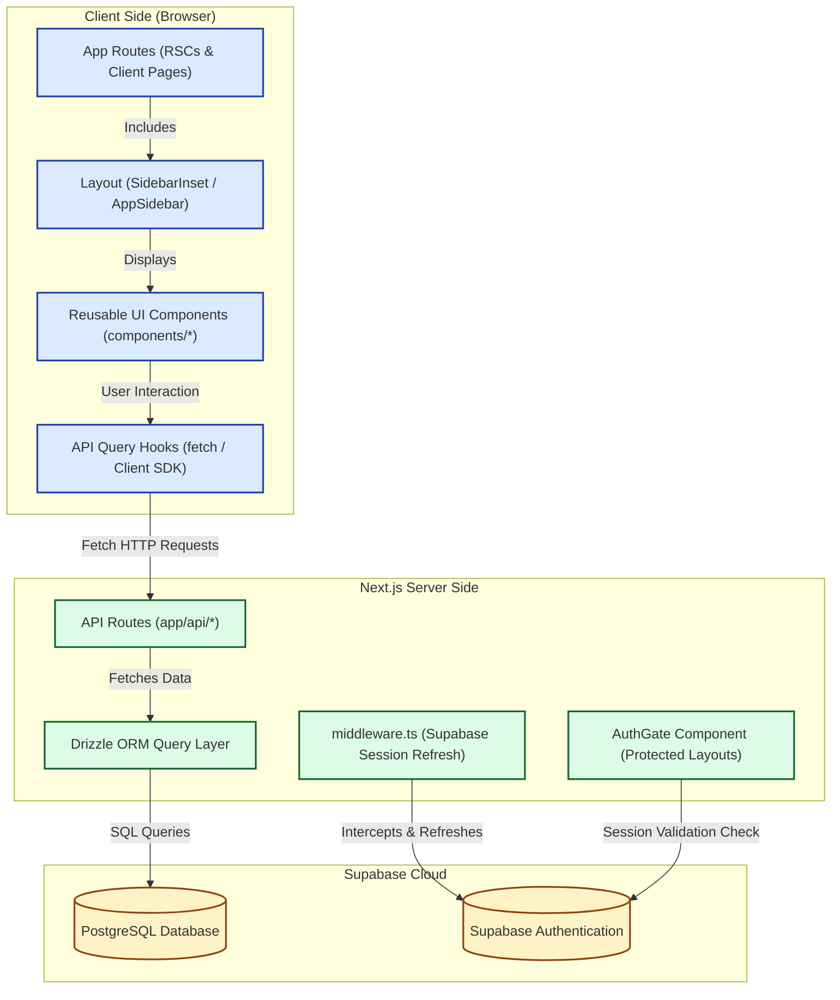

# Frontend Architecture & Best Practices Guide

This document provides a comprehensive overview of the **Vaksetu** frontend codebase, detailing how everything is connected, identifying refactoring and styling best practices, and offering a robust guide for future developers (and AI agents) to consistently modify UI components and add new features.

---

## 1. System Architecture & Data Flow

Below is a visual representation of how the Vaksetu application handles routing, authentication gating, layout assembly, database querying, and translation.



### Key Architectural Concepts
1. **Hybrid Rendering Strategy**:
   - The application relies on Next.js App Router. Main page setups benefit from Server Components for SEO and speed, while highly interactive components (like speech transcription and 3D avatar rendering) make clean use of React client directives (`"use client"`).
2. **Session and Authentication Management**:
   - `middleware.ts` runs on the Next.js Edge Runtime. It intercepts page requests to verify and seamlessly refresh the Supabase session cookie, ensuring that credentials never expire during active sessions.
   - UI redirecting is handled declaratively in the layout layer via the `<AuthGate>` component. This blocks unauthenticated traffic and routes visitors to the login views gracefully.
3. **Data Hydration Layer**:
   - The Drizzle ORM acts as the type-safe link to our PostgreSQL database. 
   - Under pages like the Quiz Engine, the backend performs **Hydration**, turning static references to glosses inside the DB into fully structured objects with media URLs.

---

## 2. Directory Layout & Component Analysis

To keep files organized and easily maintainable, it is vital to know where codebase assets live and how they relate.

### 2.1 Directory Structure Overview

Here is an overview of the key directories within `vaksetu`:

```
vaksetu/
├── app/                      # Next.js App Router routes
│   ├── (protected)/          # Protected routes requiring AuthGate authentication
│   │   ├── explore/          # Exploration pages (dashboard, resources, quiz, dictionary)
│   │   │   ├── communities/
│   │   │   ├── dictionary/
│   │   │   ├── quiz/
│   │   │   ├── resources/
│   │   │   └── transcribe/
│   │   └── settings/         # User Settings page
│   ├── api/                  # API endpoints (e.g., quiz engine hydration)
│   ├── login/                # Authentication / Login entry page
│   ├── globals.css           # Global CSS file and Tailwind v4 theme configs
│   └── layout.tsx            # Main root layout wrapping the entire app
├── components/               # Core frontend components
│   ├── auth/                 # Auth UI components (AuthGate, LoginBlocker)
│   ├── avatar/               # Output rendering components (GlossVideoPlayer, SignAvatar)
│   ├── communities/          # Group forum/modal dialog components
│   ├── leaderboard/          # Gamified ranking cards and items
│   ├── shared/               # Reusable shared layout blocks (e.g., PageHeader)
│   └── ui/                   # Shadcn/ui foundational primitives (cards, input, buttons)
├── docs/                     # Project architectural guides and documentation
├── hooks/                    # Reusable React hooks
├── lib/                      # SDK, Drizzle definitions, API and Supabase clients
└── types/                    # Shared TypeScript interfaces
```

---

### 2.2 Component Reusability & Redundancy Report

A thorough analysis of the repository shows **very healthy component reuse** and no major duplications.

* **Reusability Check (Pass)**:
  - The login mechanism is centralized. Instead of recreating layout code, `app/login/page.tsx` directly renders the reusable `@/components/auth/login-blocker` component.
  - Protected layout gates (`app/(protected)/layout.tsx`) use `@/components/auth/auth-gate` for centralized protection logic.
* **Semantic Component Layout (Cleanly Grouped Folders)**:
  - Root-level components have been fully refactored and organized into logical, structured subdirectories:
    1. **Layout Components**: `app-header.tsx`, `app-sidebar.tsx`, `nav-main.tsx`, `nav-projects.tsx`, and `nav-user.tsx` sit in the `components/layout/` directory.
    2. **Translation Input Components**: `camera-preview.tsx` and `microphone-input.tsx` sit in the `components/translation/` directory.
    3. **Domain-Specific Cards**: `dictionary-card.tsx` sits in `components/dictionary/` and `topic-card.tsx` sits in `components/topics/`.
* **Two Core Translation Modes (Complementary, Not Redundant)**:
  - There are two distinct sign-rendering files in `components/avatar/` that might appear redundant at first glance but serve completely different output channels:
    1. **`GlossVideoPlayer.tsx`**: Translates input English phrases into sequential videos representing specific human-recorded sign language words (glosses). It features an elegant **fingerspelling fallback mechanism** (splitting missing words into character-by-character sign videos).
    2. **`SignAvatar.tsx`**: Implements a real-time, interactive **3D mesh character** rendered on a Three.js Canvas (`@react-three/fiber`). Perfect for scalable, dynamic, procedurally generated animations.

---

## 3. Global CSS & Design System Consistency

### 3.1 The Color Variance Challenge

A scan of the code revealed that **green shades are heavily hardcoded** directly into components using inline Tailwind classes. This has caused style variance between different developer and agent sessions:

* **Shades Used**: `green-50`, `green-100`, `green-200`, `green-300`, `green-400`, `green-500`, `green-600`, `green-700`, `green-800`, `green-900`, `green-950`.
* **The Risk**: When an agent or developer adds a UI button, card, or border, they might choose `bg-green-600` while another chooses `bg-green-800` or custom HEX coordinates, fragmenting the visual design.

---

### 3.2 Solution: Unified Brand Green System

Tailwind v4 theme configurations are now customized with a unified, semantic green color scale under the `brand` keyword inside the global stylesheet. This successfully guarantees visual design consistency.

> [!TIP]
> **Brand Green Specs (Curated Dark Emerald Palette)**
> - Primary Actions / Accent: **`brand-800`** (`#166534` - the preferred rich dark variant of green)
> - Borders & Subtle Outlines: **`brand-200`** or **`brand-600/30`**
> - Backgrounds: **`brand-50`** (Light Mode) / **`brand-900/10`** or **`brand-950/20`** (Dark Mode)

#### Configured in [globals.css](file:///c:/DEV/Project/Final_Year/vak_setu_2/vaksetu/app/globals.css)
These are active inside the `@theme inline` block in `app/globals.css`:

```css
@theme inline {
  /* ... existing theme mappings ... */

  /* Centralized Brand Green Palette */
  --color-brand-50: #f0fdf4;
  --color-brand-100: #dcfce7;
  --color-brand-200: #bbf7d0;
  --color-brand-300: #86efac;
  --color-brand-400: #4ade80;
  --color-brand-500: #22c55e;
  --color-brand-600: #16a34a;
  --color-brand-700: #15803d;
  --color-brand-800: #166534;  /* Primary rich dark green accent */
  --color-brand-900: #14532d;
  --color-brand-950: #052e16;
}
```

#### How to Use Brand Colors in Components
All future components should avoid using standard `green-X` classes. Instead, use the semantic `brand-X` classes. Because it hooks into Tailwind v4, full opacity modifiers are supported:

| Element | Old Practice (Inconsistent) | New Best Practice (Consistent) |
| :--- | :--- | :--- |
| **Primary Buttons** | `bg-green-800 hover:bg-green-950 text-white` | `bg-brand-800 hover:bg-brand-900 text-white` |
| **Card Borders** | `border-green-600/40 hover:border-green-500` | `border-brand-800/30 hover:border-brand-800` |
| **Light BG Banners** | `bg-green-50/50 dark:bg-green-900/10` | `bg-brand-50/50 dark:bg-brand-900/10` |
| **Text Badges** | `text-green-700 dark:text-green-400` | `text-brand-800 dark:text-brand-300` |

---

## 4. Developer Instruction Guide

### 4.1 How to Apply Changes to Existing UI Components

If you need to tweak the styles, properties, or behavior of an existing component:

1. **Locate the Component**: Find the component within `components/` subdirectories. (e.g., [dictionary-card.tsx](file:///c:/DEV/Project/Final_Year/vak_setu_2/vaksetu/components/dictionary/dictionary-card.tsx) or [app-sidebar.tsx](file:///c:/DEV/Project/Final_Year/vak_setu_2/vaksetu/components/layout/app-sidebar.tsx)).
2. **Review Client vs Server Rules**: Check if the component requires state or browser hooks (`useState`, `useEffect`). If yes, verify it has the `"use client"` directive at the top.
3. **Apply Stylings Consistent with the Design System**: Always use the custom `brand` classes to enforce consistent green accents.
4. **Test Responsive Fit**: Ensure styling changes support both desktop grids and compact layouts.

---

### 4.2 How to Add New Pages & Features Easily

Vaksetu's modular design makes adding new explorer tabs or dashboard widgets simple and painless.

#### Step 1: Create Database Tables (If Applicable)
If your new feature needs database persistence, define it under `lib/db/schema.ts` (using Drizzle ORM schema structure). Run migration commands to generate and push schemas to Supabase:
```powershell
npx drizzle-kit generate
npx drizzle-kit push
```

#### Step 2: Set Up API Endpoints
Create a routing folder under `app/api/your-feature/route.ts` if dynamic server-side hydration or data processing is required. Standardize on returning JSON structures with explicit TypeScript interfaces.

#### Step 3: Implement Reusable Subcomponents
Write component modules inside a semantic subfolder in `components/` (e.g. `components/your-feature/`). Keep state logic localized and leverage Shadcn UI primitives under `components/ui/` for fast, unified style development.

#### Step 4: Create the Router Page
Create a file at `app/(protected)/explore/your-feature/page.tsx` for your client interface:
- It automatically inherits the Sidebar and Topbar structure because it is wrapped by `app/(protected)/explore/layout.tsx`.
- Wrap the page body with a page header using `<PageHeader title="Your Feature Name" />` from the shared components.

#### Step 5: Hook into Navigation
To expose your new feature tab, open [app-sidebar.tsx](file:///c:/DEV/Project/Final_Year/vak_setu_2/vaksetu/components/layout/app-sidebar.tsx) and add a navigation object under `navMain`:
```typescript
{
    title: "New Feature",
    url: "/explore/your-feature",
    icon: NewFeatureIcon, // Reusable Lucide Icon
}
```

---

## 5. Summary Checklists for Next Year

### 5.1 Style & Color Rules
- [ ] **Do NOT** use `green-50` to `green-950` classes directly in new markup code.
- [ ] **DO** use custom `brand-50` to `brand-950` colors mapped inside `app/globals.css`.
- [ ] **DO** default to **`brand-800`** as the main, premium dark green highlight color.
- [ ] **DO** use opacity multipliers (e.g. `brand-800/10`) for overlays and muted highlights instead of custom HEX strings.

### 5.2 Codebase Cleanliness Rules
- [ ] **Do NOT** clutter the root `components/` directory. Group cards, sliders, inputs, or headers into specialized subfolders (e.g. `components/layout/` or `components/dictionary/`).
- [ ] **DO** reuse `@/components/auth/login-blocker` and `auth-gate` for all authentication tasks.
- [ ] **DO** write explicit TypeScript types for all fetched objects to ensure seamless compatibility with Drizzle queries.
